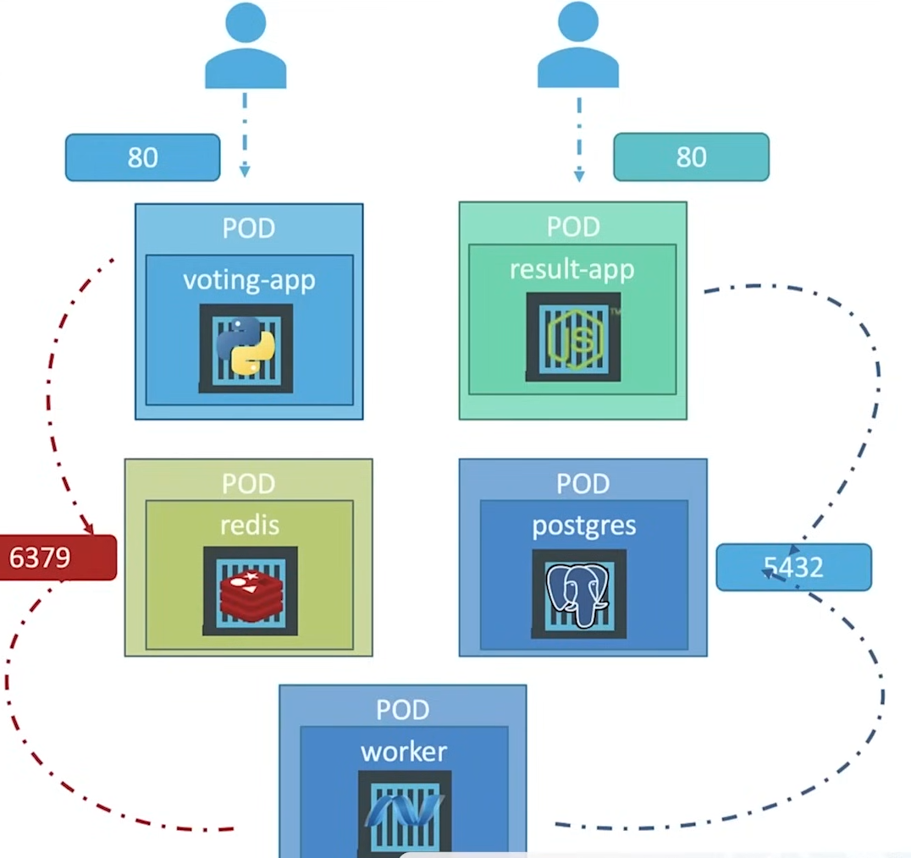

# Kubernetes Voting Application

This repository contains a microservices-based voting application that can be deployed to Kubernetes. The application consists of multiple components working together to provide a complete voting system.



## Architecture Overview

The application consists of several microservices running in separate pods:

- **Voting App**: Frontend service that collects user votes through a web interface
- **Result App**: Frontend service that displays the voting results
- **Redis**: In-memory database that temporarily stores votes
- **PostgreSQL**: Persistent database that stores the final voting results
- **Worker**: Background service that processes votes from Redis and stores them in PostgreSQL

The services communicate with each other through defined ports:
- Voting App is accessible on port 80
- Result App is accessible on port 80
- Redis runs on port 6379
- PostgreSQL runs on port 5432

## Deployment Guide

### Prerequisites

- Kubernetes cluster (local or cloud-based)
- kubectl CLI tool installed and configured
- Docker (for local development)

### Deployment Steps

1. **Clone the Repository**

   ```
   git clone <repository-url>
   cd <repository-directory>
   ```

2. **Apply Kubernetes Configuration Files**

   Apply all the necessary configuration files to deploy the application components:

   ```
   kubectl apply -f k8s/
   ```

   This will create all required deployments, services, and pods in your Kubernetes cluster.

3. **Verify the Deployment**

   Check if all pods are running correctly:

   ```
   kubectl get pods
   ```

   Ensure all services are properly created:

   ```
   kubectl get svc
   ```

4. **Access the Application**

   - To access the Voting application, find the external IP or NodePort for the voting-app service
   - To access the Results application, find the external IP or NodePort for the result-app service

## Scaling the Application

You can scale individual components as needed:

```
kubectl scale deployment voting-app --replicas=3
kubectl scale deployment result-app --replicas=2
kubectl scale deployment worker --replicas=2
```

## Troubleshooting

If you encounter issues with the deployment:

1. Check pod status:
   ```
   kubectl get pods
   ```

2. View logs for a specific pod:
   ```
   kubectl logs <pod-name>
   ```

3. Check service connectivity:
   ```
   kubectl describe svc <service-name>
   ```

## Architecture Details

The diagram illustrates the following workflow:

1. Users access the Voting App frontend
2. Votes are temporarily stored in Redis
3. The Worker service processes votes from Redis
4. Processed votes are stored in PostgreSQL
5. The Result App displays the current vote tallies from PostgreSQL

## Technology Stack

- **Frontend**: Web-based voting and results interfaces
- **In-memory Database**: Redis for temporary storage
- **Persistent Database**: PostgreSQL for final vote storage
- **Container Orchestration**: Kubernetes
- **Containerization**: Docker
